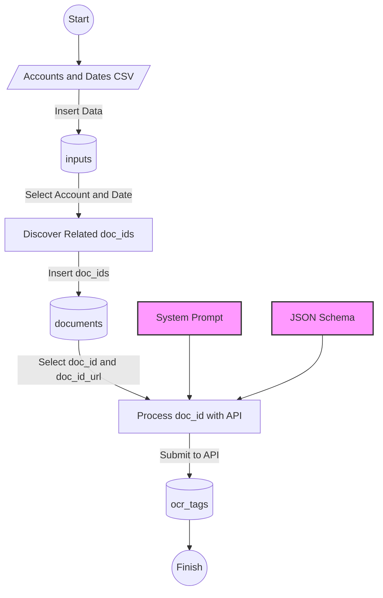
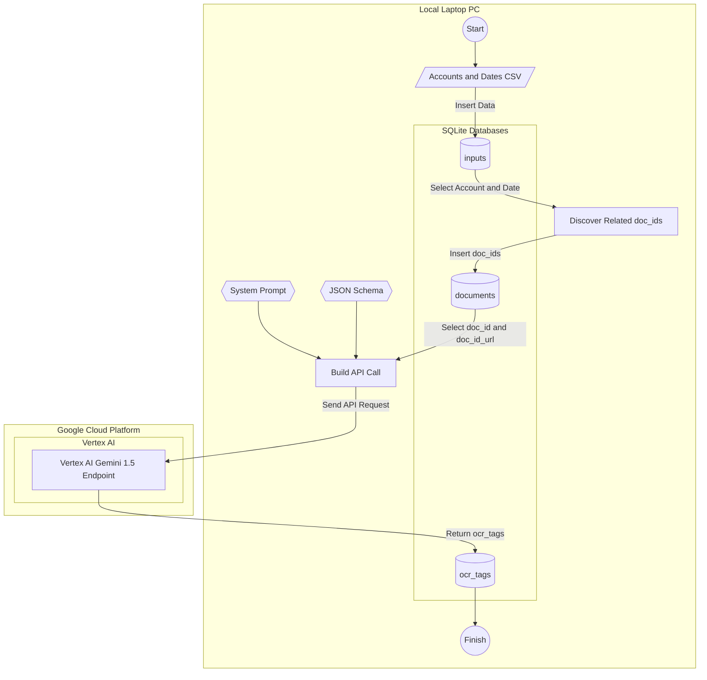
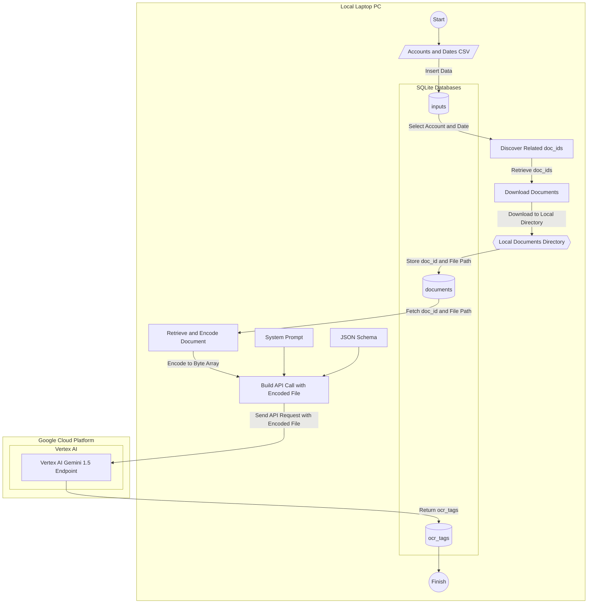

```mermaid
flowchart TD
    %% Start of the Process
    start((Start))

    %% Data Input
    A[/Accounts and Dates CSV/]

    %% Input Table
    B[(inputs)]

    %% Process Node
    C[Discover Related doc_ids]

    %% Documents Table
    D[(documents)]

    %% System Prompt Node
    E[System Prompt]:::document

    %% JSON Schema Node
    F[JSON Schema]:::document

    %% API Processing Node
    G[Process doc_id with API]

    %% OCR Tags Table
    H[(ocr_tags)]

    %% End of the Process
    finish((Finish))

    %% Data Flow
    start --> A
    A --> |Insert Data| B
    B --> |Select Account and Date| C
    C --> |Insert doc_ids| D
    D --> |Select doc_id and doc_id_url| G
    E --> G
    F --> G
    G --> |Submit to API| H
    H --> finish

    %% Style Definitions
    classDef document fill:#f9f,stroke:#333,stroke-width:2px;
```

Platformed might look like this

```mermaid
flowchart TD
    %% Local Laptop PC Subgraph
    subgraph Local_Laptop_PC ["Local Laptop PC"]
        direction TB

        %% SQLite Databases Subgraph
        subgraph SQLite_Databases ["SQLite Databases"]
            B[(inputs)]
            D[(documents)]
            I[(ocr_tags)]
        end

        %% Processes and Data Inputs
        start((Start))
        A[/Accounts and Dates CSV/]
        C[Discover Related doc_ids]
        E{{System Prompt}}
        F{{JSON Schema}}
        G[Build API Call]
        finish((Finish))
    end

    %% Google Cloud Platform (GCP) Subgraph
    subgraph GCP ["Google Cloud Platform"]
        direction TB

        %% Vertex AI Subgraph
        subgraph VertexAI ["Vertex AI"]
            H[Vertex AI Gemini 1.5 Endpoint]
        end
    end

    %% Data Flow
    start --> A
    A --> |Insert Data| B
    B --> |Select Account and Date| C
    C --> |Insert doc_ids| D
    D --> |Select doc_id and doc_id_url| G
    E --> G
    F --> G
    G --> |Send API Request| H
    H --> |Return ocr_tags| I
    I --> finish
```

we need to manifiest the files locally and then send to api

```mermaid
flowchart TD
    %% Local Laptop PC Subgraph
    subgraph Local_Laptop_PC ["Local Laptop PC"]
        direction TB

        %% SQLite Databases Subgraph
        subgraph SQLite_Databases ["SQLite Databases"]
            B[(inputs)]
            D[(documents)]
            I[(ocr_tags)]
        end

        %% Processes and Data Inputs
        start((Start))
        A[/Accounts and Dates CSV/]
        C[Discover Related doc_ids]
        J[Download Documents]
        L{{Local Documents Directory}}
        M[Retrieve and Encode Document]
        E[System Prompt]
        F[JSON Schema]
        G[Build API Call with Encoded File]
        finish((Finish))
    end

    %% Google Cloud Platform (GCP) Subgraph
    subgraph GCP ["Google Cloud Platform"]
        direction TB

        %% Vertex AI Subgraph
        subgraph VertexAI ["Vertex AI"]
            H[Vertex AI Gemini 1.5 Endpoint]
        end
    end

    %% Data Flow
    start --> A
    A --> |Insert Data| B
    B --> |Select Account and Date| C
    C --> |Retrieve doc_ids| J
    J --> |Download to Local Directory| L
    L --> |Store doc_id and File Path| D
    D --> |Fetch doc_id and File Path| M
    M --> |Encode to Byte Array| G
    E --> G
    F --> G
    G --> |Send API Request with Encoded File| H
    H --> |Return ocr_tags| I
    I --> finish

```