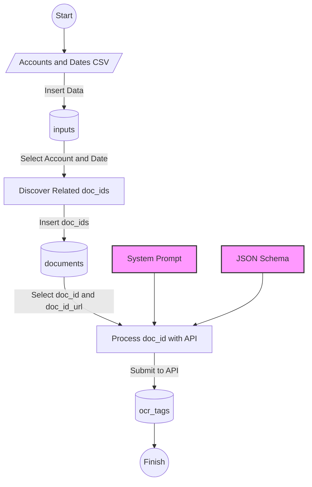

```mermaid
flowchart TD
    %% Start of the Process
    start((Start))

    %% Data Input
    A[/Accounts and Dates CSV/]

    %% Input Table
    B[(inputs)]

    %% Process Node
    C[Discover Related doc_ids]

    %% Documents Table
    D[(documents)]

    %% System Prompt Node
    E[System Prompt]:::document

    %% JSON Schema Node
    F[JSON Schema]:::document

    %% API Processing Node
    G[Process doc_id with API]

    %% OCR Tags Table
    H[(ocr_tags)]

    %% End of the Process
    finish((Finish))

    %% Data Flow
    start --> A
    A --> |Insert Data| B
    B --> |Select Account and Date| C
    C --> |Insert doc_ids| D
    D --> |Select doc_id and doc_id_url| G
    E --> G
    F --> G
    G --> |Submit to API| H
    H --> finish

    %% Style Definitions
    classDef document fill:#f9f,stroke:#333,stroke-width:2px;
```